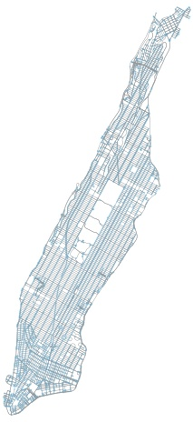

[](https://badge.fury.io/py/OSMnx) [](https://travis-ci.org/gboeing/osmnx)

# OSMnx

**Python for street networks**

Retrieve, construct, analyze, and visualize street networks from OpenStreetMap: [full overview](http://geoffboeing.com/2016/11/osmnx-python-street-networks/).

You can read/cite the journal article manuscript: Boeing, G. 2016. "[OSMnx: New Methods for Acquiring, Constructing, Analyzing, and Visualizing Complex Street Networks](http://geoffboeing.com/publications/osmnx-complex-street-networks/)." Manuscript under review. doi:10.2139/ssrn.2865501.

## Overview

**OSMnx** is a Python 2+3 package that lets you download spatial geometries and construct, project, visualize, 
and analyze street networks from OpenStreetMap's APIs. Users can download and construct walkable, drivable, or bikable 
urban networks with a single line of Python code, and then easily analyze and visualize them:

```
import osmnx as ox
G = ox.graph_from_place('Manhattan, New York, USA', network_type='drive')
ox.plot_graph(ox.project_graph(G))
```


In a couple lines of code you can examine intersection density, network circuity, average block size, PageRank,
betweenness centrality, connectivity, spatial distribution of dead-ends or 4-way intersections, etc for anywhere in the world:

```
basic_stats = ox.basic_stats(G)
print(basic_stats['circuity_avg'])

extended_stats = ox.extended_stats(G)
print(extended_stats['pagerank_max_node'])
```

## Installation

```
pip install osmnx
```

If you are on **Windows**, install [geopandas and rtree](http://geoffboeing.com/2014/09/using-geopandas-windows/), *before* pip installing OSMnx. 
If you are on **Mac**, install rtree via [conda-forge](https://anaconda.org/conda-forge/rtree), *before* pip installing OSMnx.
If you are on **Linux**, follow the rtree installation [instructions](http://toblerity.org/rtree/install.html#nix), *before* pip installing OSMnx.

## How to use OSMnx

For a quick demo overview of OSMnx, see this [demo notebook](examples/01-overview-osmnx.ipynb).

### Create place boundary shapefiles from OpenStreetMap

OSMnx lets you download spatial "place boundary" geometries from OpenStreetMap (for cities, counties, states, countries, boroughs, etc.), save them to shapefiles, 
project them, and plot them. For example, to retrieve, construct, and save a shapefile of Berkeley's administrative boundaries:

```
city = ox.gdf_from_place('Berkeley, California')
ox.save_gdf_shapefile(city)
```

For a more in-depth demonstration of creating these shapefiles, 
see [this notebook](examples/02-example-osm-to-shapefile.ipynb).

### Download and construct street networks

OSMnx lets you download street network data and build topologically-corrected street networks, project to UTM and plot the 
networks, and save the street network as SVGs, GraphML files, or shapefiles for later use. The street networks are 
directed and preserve one-way directionality. API responses are cached locally so OSMnx doesn't have to request the same
data from the API multiple times, saving bandwidth and increasing speed.

For a more in-depth demonstration of creating street networks, 
see [this notebook](examples/03-example-osm-place-network.ipynb).

You can download a street network by providing OSMnx any of the following (demonstrated in the examples below):
  - a bounding box
  - a lat-long point plus a distance (either distance along the network, or cardinal)
  - an address plus a distance (either distance along the network, or cardinal)
  - a place name or list of place names (for OSMnx to automatically geocode and get the boundary of)
  - a polygon of the desired street network's boundaries

You can also specify several different network types:
  - `drive` - get drivable public streets (but not service roads)
  - `drive_service` - get drivable streets, including service roads
  - `walk` - get all streets and paths that pedestrians can use (this network type ignores one-way directionality)
  - `bike` - get all streets and paths that cyclists can use
  - `all` - download all non-private OSM streets and paths
  - `all_private` - download all OSM streets and paths, including private-access ones

### Correct and simplify street network topology

Simplification is normally done by OSMnx automatically under the hood, but we can break it out to see how it works. 
OpenStreetMap nodes include intersections, but they also include all the points along a single block where 
the street curves. The latter are not nodes in the graph theory sense, so we remove them algorithmically and consolidate the 
set of edges between "true" network nodes into a single edge, but retain the actual spatial geometry. There are two 
simplification modes, strict and non-strict. The main difference is that unlike strict mode, non-strict mode allows 
simplification to an "expansion graph". For a more in-depth demonstration of topological simplification with OSMnx, 
see [this notebook](examples/04-example-simplify-network.ipynb).

### Save street networks to disk

OSMnx allows users to save street networks to disk as shapefiles to work with in GIS software, as GraphML files
to work with in Gephi or NetworkX, and as SVG files to work with in Illustrator. It also allows you to save place
boundary geometries as shapefiles. For more examples of saving and loading networks to/from disk, 
see [this notebook](examples/05-example-save-load-networks-shapes.ipynb).

### Analyze and visualize street networks

OSMnx allows you to calculate origin-destination routes along the network and quickly visualize them. You can easily
visualize one-way streets, cul de sacs, high/low connectivity intersections, etc. OSMnx provides built-in capabilities
to quickly calculate spatial network metrics like intersection density, average intersection degree, edge density, 
average street segment length, clustering coefficients, betweenness centrality, etc. For more examples of analyzing street networks with OSMnx, 
see [this notebook](examples/06-example-osmnx-networkx.ipynb)

For a more complete overview of [OSMnx, read this](http://geoffboeing.com/2016/11/osmnx-python-street-networks/).

Download/cite the [paper here](http://geoffboeing.com/publications/osmnx-complex-street-networks/).